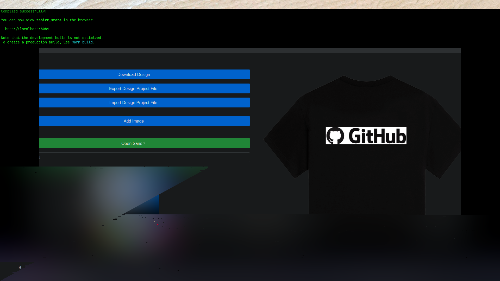

# React Typescript/Axios/Node API/Mariadb

A working tshirt design tool prototype.

### Usage

This tool is designed to be implemented with a working ecommerce platform.

---

Allows for:

    - Text manipulation inside the image editor

        - Font selection via Google fonts API

    - Image import.

        - Also allows for image size manipulation.

    - Design export for backing up or saving any current T Shirt designs(json).

    - Design import for loading exported item designs.

    - T-Shirt color customization.

---

### Installation

cd into the working directory of choice:

clone the repo

```
git clone https://github.com/gary23w/tshirt_app_tsreact
```

move into the tshirt_app_tsreact directory

```
npm install
```

**_currently the API runs separate node modules. For larger scales we plan to run the API inside differen't infrastructure._**

execute

```
npm start
```

---

_concept_



---

# Contributing

All contributions are welcome. Please reach out to me on discord for any more details.

gary23w#2706
